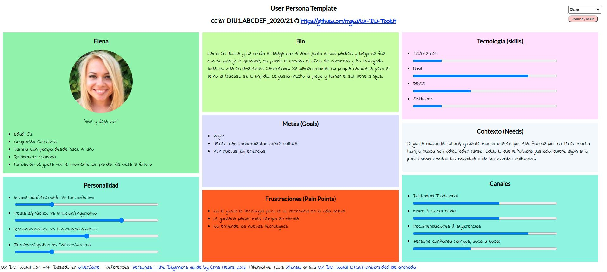
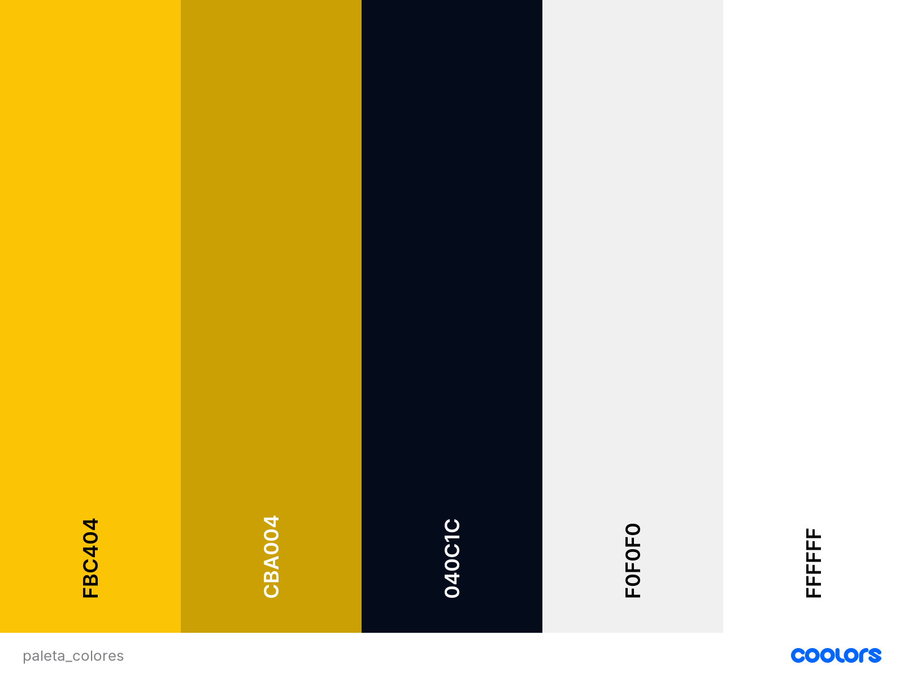
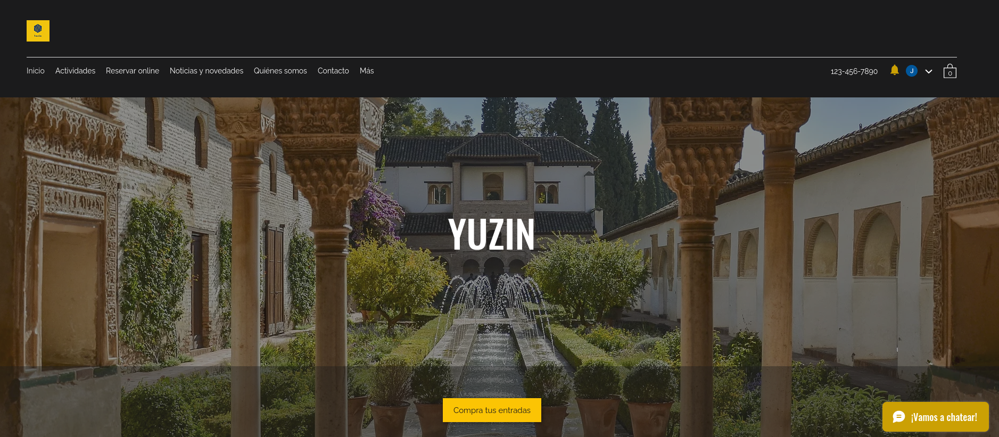
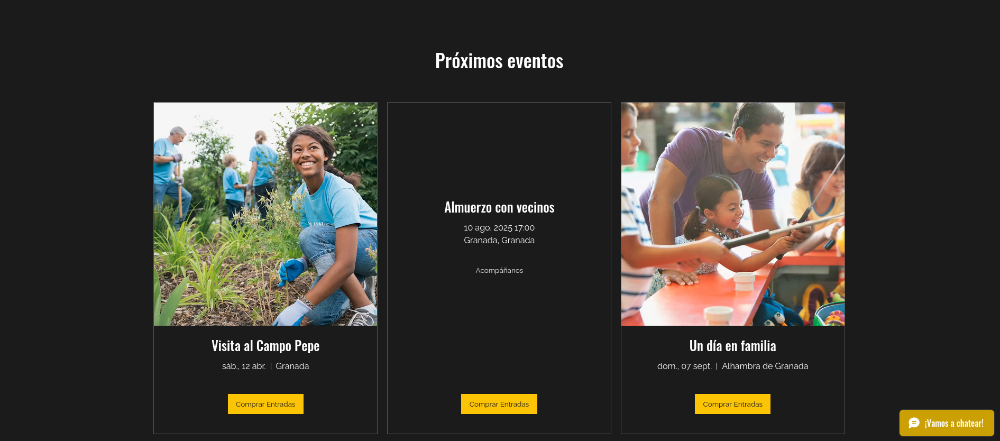
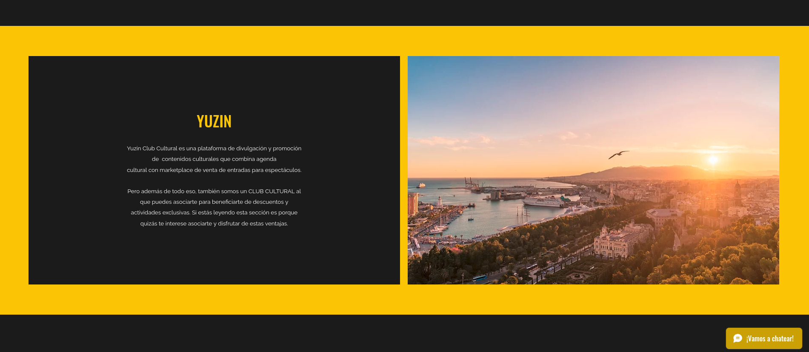
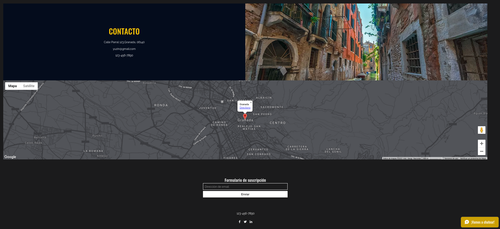
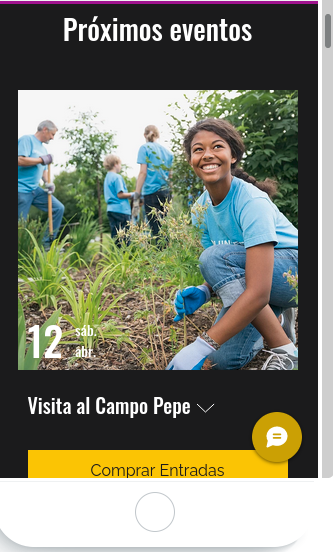

# DIU21
Prácticas Final DIU

Alumno: :bust_in_silhouette:  Escalona García, Alejandro

Curso: 2020/21 

Descripción: 

Está práctica final consta de dos partes, en primer lugar una en la que debemos exponer y explicar como ha sido nuestra experciencia con los conocimientos de UX/Usabilidad y en segundo lugar deberemos aplicar todos los conocimientos aprendidos durante el curso al realizar un caso de uso de la web de YUZIN,

----- 

# PARTE I: MI EXPERIENCIA UX 

En cuanto a mi experiencia con UX/IU/Usabilidad lo primero comentar que nunca había aprendido nada acerca de todo lo que se ha dado y estudiado en la asignatura, si que he oído hablar de ello, ya que cuando estuve trabajando en PcComponentes había un pequeño departamento de UX/UI pero siempre estaban muy apartados y a su bola y aparentemente para el resto de la empresa no hacían mucho por lo que en el mundo empresarial y desde mi experiencia parece que no están muy bien mirados los profesionales de este campo.

En cuanto a los conocimientos de la asignatura, lo que más me ha llamado la atención personalmente es el hecho de que poder hacer mucho más usable una aplicación web o un programa, me parece fascinante como con algún “pequeño” cambio sea tan drástico el uso de una aplicación. Por lo que ahora procedo a comentar los usos que le he podido dar a todos los conocimientos que he podido ir adquiriendo a lo largo del curso.

Lo primero de todo que me pareció bastante relevante aunque quizás a priori no lo parece es lo de crear el “buyer persona” es decir la persona que puede adquirir o usar tu producto. A simple vista puede parecer no tan útil pero cuando se realiza y de verdad piensas en ponerte en el lugar de la persona creada ver muchos fallos que algunos muy simples pero de gran importancia, como puede ser el tamaño de la fuente, gestos en una aplicación móvil o usar un menú de navegación dentro de un web. Este último lo he podido vivir en primera persona ya que llevo trabajando 1 año en una empresa de desarrollo web y software en el que tenemos un ERP. Y el diseñador gráfico no suele tener muy en cuenta todos estos apartados que hemos visto en la asignatura. Lo cual hace que aún sean más útiles todos los conocimientos adquiridos. Gracias a lo de crear la persona pudimos mejorar un menú de un diseño web, ya que quizás para nosotros que estamos acostumbrados no era muy complejo pero para personas que no tienen tanta habilidad con los ordenadores o incluso en el menú responsive en el móvil le costaba bastante navegar por el.

Otra de las cosas que ha tenido bastante repercusión en nuestras prácticas de la asignatura ha sido el task flow, en el que hemos ido desgranando todo el proceso desde que un usuario entra en la app hasta que se puede dar por terminado su uso. Gracias a esta acción hemos podido detectar muchas posibles mejoras que le podíamos dar como modificar el tipo de los botones, su tamaño e incluso las transiciones entre pantallas. Esto trasladado al mundo real, lo pude aplicar al proponerle a mi jefe realizar un task flow del ERP que tenemos en la empresa. Y después de exponerle los posibles puntos que se podían mejorar, realizamos diversas mejoras que incluso algunos clientes nos escribieron felicitandonos de los nuevos cambios, como puede ser el cambiar los tipos de botones y sus iconos y dividiendo grandes pasos en algunos más pequeños que sean más fáciles de seguir.

Otra actividad que a priori puede parecer que no sea muy relevante es la elección de los colores de nuestro sistema, puede parecer una elección por simples gustos de los colores pero detrás de ello hay mucho más, ya que dependiendo de la combinación de colores podemos reflejar unas emociones y unos valores diferentes, como por ejemplo nunca veremos un dentista que tenga como color principal de su imagen de marca al negro o rojo ya que no reflejan salud o higiene como son con el verde o azul. Esto por suerte el diseñador que tenemos en la empresa lo realiza bastante bien aún así nos fijamos bastante en el contraste de colores con el texto, ya que en algunas ocasiones los botones o títulos debemos cambiarlos de color y debemos estar siempre atentos a que sea muy distinguidos o personal como visión reducida o daltonicos podrían no verlo correctamente o ni siquiera verlo.

Por último una de las actividades que hemos podido aprender a realizar en la asignatura y de las más importantes y vistosas sobre todo es la realización de un mock up de la aplicación o web. Esto ayuda mucho antes de ponerte a desarrollar la app o web para ver los posibles fallos de diseño y analizar lo que queremos realizar y cómo queremos realizarlo. Ya que esto nos permite incluso comprobar cómo van a ser las transiciones y uso de una aplicación. Este tipo de actividad además de usarlo en las prácticas de esta asignatura, le dimos un valor real en la asignatura de Desarrollo de Software donde teníamos que crear una aplicación real, y que se viese un uso en un simulador móvil. En mi opinión fue fundamental ya que gracias a poder realizar previamente al desarrollo de un mock up de la app, pudimos modificar muchas ítem como los colores que teníamos previamente definidos, botones que antes eran desplegables o imágenes en las que había que pulsar y no quedaba claro su comportamiento además de que luego para la hora de desarrollarlo teníamos una imagen más clara de lo que queríamos al final. Esto también es fundamental para el mundo empresarial ya que a un cliente por norma general previo a firmar el desarrollo de alguna aplicación se le suele enseñar un previo para que apruebe el diseño y la web en general por lo que he podido reforzar el conocimiento de esta actividad también ejecutándola en el mundo laboral.

Por concluir con todo lo expuesto anteriormente, comentar que son muchos los conocimientos que me llevó de la asignatura y que al principio no se le da mucho importancia o al menos a mi me pasaba pero conforme vas aplicando los conocimientos que se van adquiriendo conforme vas haciendo las diferentes prácticas te vas dando cuenta que el prestar atención a UX/IU/Accesibilidad puede ser la diferencia entre que una aplicación tenga éxito o no. Por lo que estoy muy contento de haber cursado esta asignatura y además que se puede aplicar a muchísimos campos.

# PARTE II: Caso de estudio. Web YUZIN

## Paso 1. UX Desk Research & Analisis 

### 1.a Competitive Analysis

La web a analizar es [Yuzin](https://yuzin.com/), es una web de un club cultural como se puede ver en su logo, y en ella podemos ver la agenda cultural de diferentes zonas, espacios culturales y mucho más. A lo largo de la actividad iré desgranando su diseño y funcionalidad.

Para ayudarme a analizar esta web he creado a una persona que pueda facilitarme el proceso de analisis ya que entre 2 perspectivas se pueden visualizar más errores. Ella es Elena de 53 años, es carnicera y actualmente vive en Granada y siente un gran interés por la cultura, a continuación se puede ver una imagen acerca de ella.

--------- Elena ---------------

### 1.c User Goals and Pain Points
En vez de realizar un Journey Map con las distintas personas como hemos hecho en las prácticas, voy a analizar y describir los objetivos y puntos de dolor que tiene la persona y que me pueden ayudar a la hora de analizar la web.

### Goals
Los objetivos son:
- Tener más conocimientos de cultura
- Viajar más
- Vivir nuevas experiencias

### Pain Points
Como pain points encontramos:
- No pasa el tiempo suficiente en familia
- No le gusta la tecnología
- No entiende bien la tecnologia

### 1.d Usability Review
Nota final del Usability Review: 55/100

Si analizamos los puntos buenos y malos característicos de la página podemos observar que:
- Puntos buenos: La busqueda que tiene es bastante buena y siempre esta presente, el contacto con ellos es sencillo y siempre esta visible l poder descargar la revista.
- Puntos malos: La página en primer lugar para la versión responsive es pesima, esta fatal adaptada y no creo que hayan hecho nada respecto a esta versión, por lo que ya estarian perdiendo practicamente todas las visitas que se hagan desde un dispositivo que no sea un pc. Por otro lado los colores seleccionados no hacen un alto contraste y en ocasiones ponen texto sobre imagenes muy densas lo que no permite leer con claridad. 

En conclusión de este analisis tiene muchisimos puntos a mejorar.

## Paso 2. UX Design  

La propuesta de valor que pronpongo es el rediseño total de la página, y si el cliente estuviera de acuerdo el cambio de los colores corporativos. Además se le agregaria algunas funcionalidades como un chat en directo, diferentes páginas como preguntas frecuentes ya que para webs que se pueden realizar compras online suele haber bastantes preguntas muy similares, y también da confianza al usuario para que acabe comprando. El chat en directo también facilita el dar confianza al usuario, ya que personas que no esten muy aconstumbradas a realizar compras online les asegura que hay gente detrás a su disposición.

También he optado por una gama cromatica similar a la que tiene, ya que me he basado en que el cliente no quiere modificar su gama de colores. Pero dandole mucha más importancia al negro, ya que suele ser un color que bien utilizado da mucho juego, y con el toque del color oro puede dar una imagen de calidad y lujo. 

La paleta de colores que he usado es la siguiente:

 Paleta de colores

-----

También he creado un nuevo logo, ya que el anterior me parecía un poco anticuado para el nuevo rediseño web por lo que el nuevo logo es el siguiente: 

 

Nuevo logotipo

Es mucho más fresco, con esa geometria rayada da mucho más imagen de arte y emoción por lo que le viene mucho mejor a una marca que quiere vender eventos culturales. El logo estará con la geometria en negro y en azul dependiendo de donde se muestre.

A continuación voy a mostrar diferentes imagenes de como quedaría el rediseño en un escritorio y movil y ya por ultimo explicaré porque el rediseño es así.

 
 
 
 
 

## Paso 4. Evaluación 

## Conclusión final / Valoración de las prácticas

>>> (90-150 palabras) Opinión del proceso de desarrollo de diseño siguiendo metodología UX y valoración (positiva /negativa) de los resultados obtenidos  

